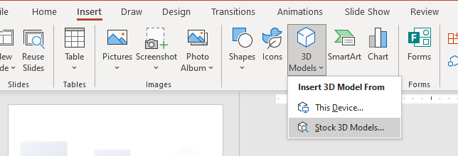

Powerpoint has this nice feature where you can add animated 3D models to the presentation

Some of this models have multiple "scenes" that show different animations. 

To create your own 3D models with multiple scenes one option is to use Blender and export a GLTF file. 

## Steps in Blender to create a GLTF file with multiple animations compatible with powerpoint

1. Create your 3D model
2. Add armature
3. Select first the object you want to animate then the armature then ctrl+p then add with automatic weights. That makes the armature a parent to the object.
4. Change to **pose mode,** add keyframes for your animation

    Up to here it works with a single animation if you want to have multiple scenes then follow the next steps

5. Change to nonlinear animation
6. Push Down Action to create a new track

    

    

7. Move time cursor to beginning
8. Unclick the track
9. Repeat steps 3-8 for each new action

    

10. Export as GLTF (GLB)

## Files

[SimpleMultiSceneForPowerpoint.blend](2021-05-12-making-3d-animations-for-powerpoint/SimpleMultiSceneForPowerpoint.blend)

[SimpleMultiSceneForPowerpoint.glb](2021-05-12-making-3d-animations-for-powerpoint/SimpleMultiSceneForPowerpoint.glb)

[SimpleMultiSceneForPowerpoint.pptx](2021-05-12-making-3d-animations-for-powerpoint/SimpleMultiSceneForPowerpoint.pptx)

This is what you will see in powerpoint

## Examples with eye movements:

[Eye plane example animations.pptx](2021-05-12-making-3d-animations-for-powerpoint/Eye_plane_example_animations.pptx)

[SimpleEyeWithPlanes.blend](2021-05-12-making-3d-animations-for-powerpoint/SimpleEyeWithPlanes.blend)

[test6.glb](2021-05-12-making-3d-animations-for-powerpoint/test6.glb)

## References

[https://docs.blender.org/manual/en/latest/addons/import_export/scene_gltf2.html](https://docs.blender.org/manual/en/latest/addons/import_export/scene_gltf2.html)

[https://www.youtube.com/watch?v=gstgT95I1Ww](https://www.youtube.com/watch?v=gstgT95I1Ww)

[https://www.youtube.com/watch?v=ggWlDs-Pxo0&t=60s](https://www.youtube.com/watch?v=ggWlDs-Pxo0&t=60s)

<model-viewer src="http://omlab.berkeley.edu/_posts\2021-05-12-making-3d-animations-for-powerpoint/SimpleEyeWithPlanes.glb" camera-controls autoplay animation-name="V">

    

        

    

    <button slot="ar-button" id="ar-button">
        View in your space
    </button>
    

        
    

</model-viewer>
